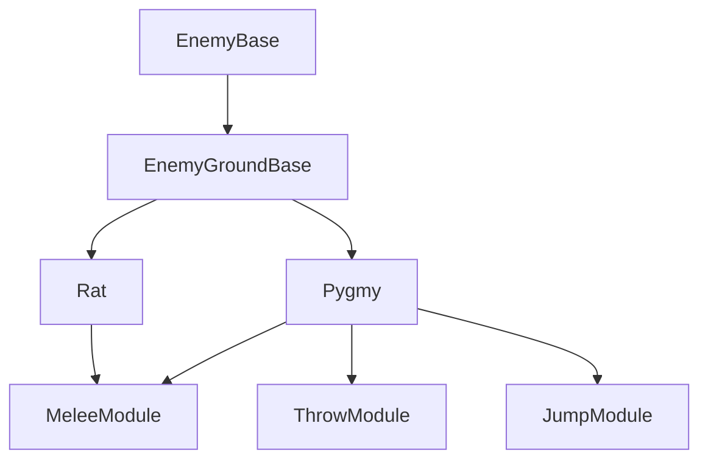
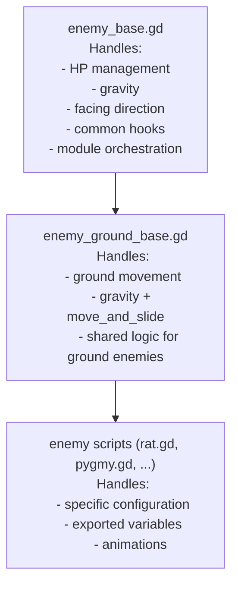

# 🏝️ Island Evolution – Rise of the Jungle Hero

A modular 2D action-adventure platformer built with **Godot 4.5.1**, featuring a highly structured codebase, evolving gameplay systems, and a stylized semi-realistic cartoon universe.

> Designed as both a playable game and a technical portfolio project showcasing modular architecture, gameplay systems, and clean state management.

---

# 🎯 Project Overview

Island Evolution is both a game and a technical architecture showcase.

It demonstrates:

- Scalable modular design
- Clean separation of concerns
- Centralized state management
- Advanced gameplay system integration
- Production-ready project organization

---

# 🐵 Scenario

## 🌴 The Setting

Lost in the heart of a mysterious archipelago, **Moko**, a young monkey, awakens on a volcanic island cursed by an ancient power.

The ecosystem collapses. Creatures mutate. Ancient totems distort reality.

At the center stands the twisted **Obsidian Totem**.

---

## 🧪 Totemic Evolution

Moko evolves through loot-driven progression.

Every collectible — 🍌 fruits, 🦴 bones, 🗡️ weapons, 🌀 skills, 💠 totemic essences — unlocks:

- New abilities
- New combat options
- Visual transformation
- New interaction mechanics

Progression is systemic, not scripted.

---

# 🧠 Gameplay Systems

## 🏃 Movement

- Double jump (unlockable)
- Sprint with stamina system
- Ramp ability
- Climb mechanics
- Fall damage
- Water current physics

## 🌊 Underwater

- Breath timer
- Breath HUD bar
- Drowning damage over time
- Bubble visuals
- Swimming state separation

## ⚔️ Combat

Selectable projectile weapons:

- Coco
- Bone
- Lance

Three gameplay modes:

- Throw Mode (J)
- Skill Mode (K)
- Heal Mode (H)

Features:

- Dynamic HUD selectors
- Cooldown systems
- Automatic deselection logic
- Persistent unlock state

## 🥷 Camouflage Skill

- Consumable charges
- Automatic revert when depleted
- Temporary enemy targeting override
- Integrated safely with combat states

---

# 🧩 Architecture

## 🧱 Player Orchestrator Pattern

The Player node instantiates modules:

```gdscript
module = ModuleName.new()
module.setup(self)
```

Each module:

- Has a single responsibility
- Is isolated
- Executes in strict order

Execution flow:

```
skills → movement → items → combat → post_movement
```

This guarantees deterministic updates and avoids timing issues.

## 📦 Player Modules

- PlayerMovement
- PlayerCombat
- PlayerSkills
- PlayerCollectItems
- PlayerCollectSkills
- PlayerHUD
- PlayerDamage
- PlayerBreath
- PlayerEffects

# 🏗 Architecture Diagram

## Player

```
GameState
   │
   ├── Player (Orchestrator)
   │       ├── Modules
   │       │      ├── PlayerMovement
   │       │      ├── PlayerCombat
   │       │      ├── PlayerSkills
   │       │      ├── PlayerCollectItems
   │       │      ├── PlayerCollectSkills
   │       │      ├── PlayerDamage
   │       │      ├── PlayerBreath
   │       │      └── PlayerEffects
   │
   ├── HUD (State reflection only)
   │
   └── Enemies (EnemyBase architecture)
```

---

## Enemy Example



---

## Inheritance Architecture (Detailed)



---

## Module Sharing (DRY Principle)

- **MeleeModule** is shared between multiple enemies (Rat, Pygmy, ...).
- Enemy abilities are implemented as **reusable modules**.
- This architecture avoids **code duplication** and keeps enemy scripts lightweight.

## 🌍 GameState (Global Manager)

Responsible for:

- Progression tracking
- Skill unlock persistence
- Inventory state
- Respawn logic
- Level transitions
- HUD synchronization
- Accessibility toggle

Uses signal-based rebinding after respawn.

---

# 🧠 Enemy System (Ongoing Refactor)

- EnemyBase inheritance
- Modular capability components
- Inspector-driven configuration
- Zone-based detection
- Melee / Ranged separation
- Respawn compatibility

---

# 🎨 Art Pipeline

All assets are custom-made.

Tools used:

- Adobe Photoshop (UI refinement & texture work)
- Clip Studio Paint (sprite sheets & character design)

Visual style: semi-realistic cartoon with clean outlines and detailed textures.

---

# 🗺 Current Levels

- Jungle
- Temple
- Spider Boss
- Mangrove (in progress)
- Toucan (planned)

---

# ♿ Accessibility (Planned)

- Directional audio cues
- Voice announcements
- Assisted jump system
- Toggle via GameState
- No gameplay advantage in normal mode

---

## 📷 Screenshots & Media

🎬 Click on the image below to watch the gameplay video:
[](https://youtu.be/8XeBQ5ShogQ)


---

# 🔧 Installation

## Requirements

Godot Engine 4.5+

## Clone

```bash
git clone https://github.com/Steph4477/video-game-with-godot-engine.git
cd video-game-with-godot-engine
```

Open `project.godot` in Godot Editor.

---

# 🚀 Roadmap

- EnemyBase modular refactor
- Mangrove completion
- Boss rework
- Optimization pass
- Itch.io release

---

# 👤 Developer

Stéphane Morel
Game Developer — Modular Gameplay Architecture Focus

---

# 📄 License

Open-source for educational purposes.

You may study and fork the code.

You may not reuse assets or commercialize the project without permission.
